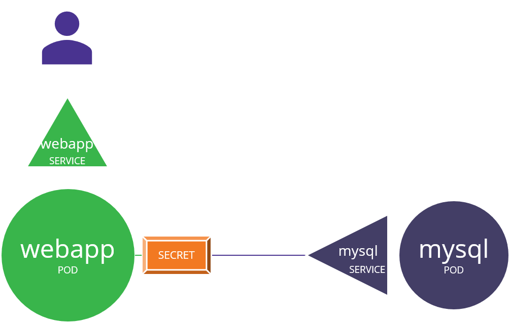

```
kubectl create secret generic db-secret --from-literal=DB_Host=sql01 --from-literal=DB_User=root --from-literal=DB_Password=password123
```

```

controlplane ~ ➜  kubectl create secret generic db-secret --from-literal=DB_Host=sql01 --from-literal=DB_User=root --from-literal=DB_Password=password123
secret/db-secret created

controlplane ~ ➜  kubectl get secret db-secret -o yaml
apiVersion: v1
data:
  DB_Host: c3FsMDE=
  DB_Password: cGFzc3dvcmQxMjM=
  DB_User: cm9vdA==
kind: Secret
metadata:
  creationTimestamp: "2023-06-25T08:21:22Z"
  name: db-secret
  namespace: default
  resourceVersion: "1074"
  uid: eeabe2c7-6c6e-4301-93b1-6b38451a9bff
type: Opaque
```

