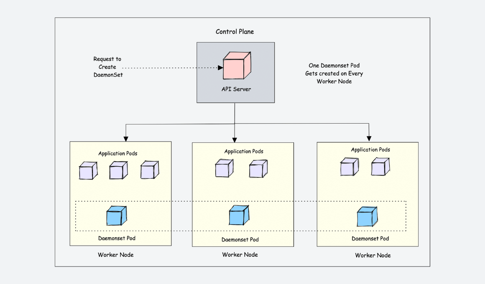

The DaemonSet object is designed to ensure that a single pod runs on each worker node. This means you cannot scale daemonset pods in a node. And for some reason, if the daemonset pod gets deleted from the node, the daemonset controller creates it again.

Let’s look at an example. If there are 500 worker nodes and you deploy a daemonset, the daemonset controller will run one pod per worker node by default. That is a total of 500 pods. However, using nodeSelector, nodeAffinity, Taints, and Tolerations, you can restrict the daemonset to run on specific nodes.

source: https://devopscube.com/kubernetes-daemonset/