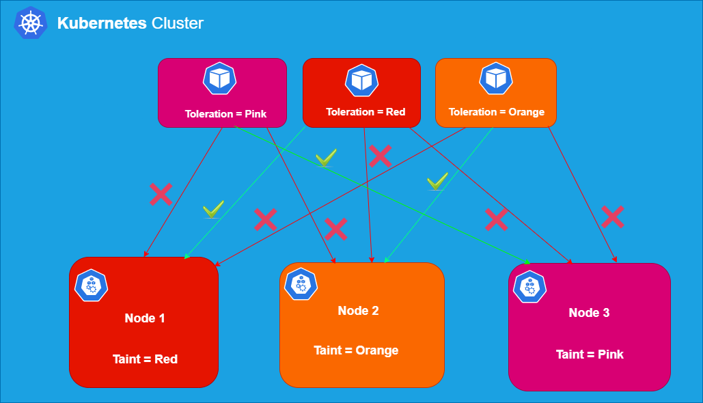

# taints
```
kubectl describe node node01 | grep -i taints
```
```
kubectl taint nodes node01 spray=mortein:NoSchedule
```
spray is the key, mortein is the value, NoSchedule is the effect

```
kubectl taint nodes controlplane node-role.kubernetes.io/control-plane:NoSchedule-
```
remove the taint on controlplane, which currently has the taint effect of NoSchedule.



Source: https://blog.learncodeonline.in/kubernetes-scheduling-taints-and-tolerations